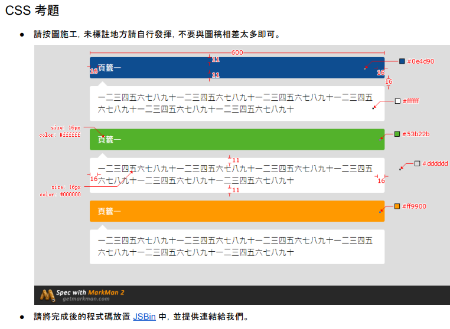

# 全曜財經(Cmoney)面試

## 面試流程

 - 11/06 初面(遠距面試，無使用視訊鏡頭)
    - 筆試，CSS 切板 1 題、 JS 1 題(或應該說 2 題) -**45 min**
    - 口試，面試官提問，口頭簡答 - **15 ~ 30min**
  

### 筆試

#### 切版題，要求使用 JSBin.com 作答，回傳連結
  
  > [JSBin](https://jsbin.com/lubavizego/edit?html,css,output)
  ```html
  <section>
    <div class="title bg-blue">頁籤一</div>
    <div class="info">一二三四五六七八九十一二三四五六七八九十一二三四五六七八九十一二三四五六七八九十一二三四五六七八九十一二三四五六七八九十一二三四五六七八九十一二三四五六七八九十</div>
  </section>
  <section >
    <div class="title bg-green">頁籤二</div>
    <div class="info">一二三四五六七八九十一二三四五六七八九十一二三四五六七八九十一二三四五六七八九十一二三四五六七八九十一二三四五六七八九十一二三四五六七八九十一二三四五六七八九十</div>
  </section>
  <section >
    <div class="title bg-orange">頁籤三</div>
    <div class="info">一二三四五六七八九十一二三四五六七八九十一二三四五六七八九十一二三四五六七八九十一二三四五六七八九十一二三四五六七八九十一二三四五六七八九十一二三四五六七八九十</div>
  </section>
  ```
  ```css
  body{
  background-color: #ddd;;
}

.title {
  background-color: #fff;
  color: #fff;
  padding: 11px 16px;
}
.info{
  background-color: #fff;
  padding: 11px 16px;
  margin-top: 16px;
  position: relative;
}
 .info::before {
  content: '';
  display: block;
  position: absolute;
  top: -10px;
  left: 15px;
  border-style: solid;
  border-width: 0 10px 10px 10px;
  border-color: transparent transparent #fff transparent;
}

section{
  margin: 30px auto;
  width: 600px;
}

.bg-blue{
  background-color: #0e4d90;
}
.bg-green{
  background-color: #53b22b;
}
.bg-orange{
  background-color: #ff9900;
}
  ```

#### JS 題
  - 原始資料: [true, true, false, true, false, false, false, true, false, true, true, false]。
  - 上述陣列中，請依序將元素分配 3 個為 1 組的交錯資料。如：[true, true, true, false, false, false, true, true, true, false, false, false]。
  - 請印出其索引值: [0, 1, 3, 2, 4, 5, 7, 9, 10, 6, 8, 11]。
  - 驗證一:
    - [false, true, true, false, true, true, false, false, true, false, false, true]
    - [1, 2, 4, 0, 3, 6, 5, 8, 11, 7, 9, 10]
  - ●驗證二:
    - [true, false, true, false, false, true, false, true, true, false, true, false]
    - [0, 2, 5, 1, 3, 4, 7, 8, 10, 6, 9, 11
  
  > [JSBin](https://jsbin.com/vahihuvelu/edit?js,console)

  ```js
  const origin1 = [true, true, false, true, false, false, false, true, false, true, true, false]
  const origin2 = [false, true, true, false, true, true, false, false, true, false, false, true]
  const origin3 = [true, false, true, false, false, true, false, true, true, false, true, false]

  const setAry = (ary) => {
    const trueCount = 3
    const falseCount = 3

    const trueGroup = ary.filter(element => element === true) // 篩選出原始資料中為 true 
    const falseGroup = ary.filter(element => element === false) // 篩選出原始資料中為 false 

    const result = []

    for (let i in ary) {
      if (i % (trueCount + falseCount) < trueCount) {
        if (trueGroup.length > 0) {
          result.push(trueGroup.shift()) // 將 trueGroup 中的資料提出並放入 result 
        }
      } else {
        if (falseGroup.length > 0) {
          result.push(falseGroup.shift()) // 將 falseGroup 中的資料提出並放入 result 
        }
      }
    }
    
    return result
  }

  console.log(setAry(origin1))
  console.log(setAry(origin2))
  console.log(setAry(origin3))
  ```

  - 這邊沒有看清楚題目要求是印出索引值，所以只做了三次驗證檢查 function 功能是否正常

### 口試

#### 請解釋什麼是 SSR？什麼是 CSR？ 兩者各有什麼優缺點？ 跟 Vue 框架的 SPA 差別在哪？
#### 請說明 JS 的 this
#### 請說明原生 HTML 中，`<script>`、`<script async>`、`<script defer>`的差異？ `<scipt>` 應該放在 HTML 中的哪個位置較好？ 為什麼？
#### Vue 框架中如果要使用全域變數可以怎麼做？ 該如何去設定/修改？
#### Vue 中 methods, watch, computed 有什麼差異？ 請舉例說明
#### 遇到 CORS 的時候，前端該如何解決？ CORS 的檢索範圍為何？ 有包含子網域、port 號嗎？
#### 什麼是 CSRF(跨站請求偽造)？
#### 什麼是 XSS(跨網站指令碼)？


## 檢討

SSR、CSR 這題，因為相關東西都交給框架處理太久，乃至於對於名詞本身已經沒有太深刻的印象，發揮得不好，還是靠著面試官解釋了一下 SSR、CSR 的中文各是什麼才喚醒了一些塵封的記憶

過程中滿多題目都是如此，業務場合太習慣於框架，導致框架幫忙處理掉的諸多問題都已經很久沒有深究

有許多答案都是面試官補充引導才比較有接著說完，但也有些答案是我自認已經解完了，但感覺面試官還希望聽到更多，可我已經不知道還能補充什麼了哈哈

CSRF、XSS 這些更是僅止於閱讀時有看過，個人技術棧是基本沒有碰過的東西，未來如果希望往更 SR 的方向走，還是需要回來了解一下

整體來講個人發揮不算好，但面試官滿耐斯的，是間有興趣可以嘗試的公司

## 補充閱讀
- [[教學] SSR 與 CSR 深度解析：從渲染方式到效能優化](https://www.shubo.io/rendering-patterns/)
- [[前端優化系列] 使用async, defer屬性加速網頁載入時間](https://gcdeng.com/blog/script-tag-async-defer-attributes)
- [鐵人賽：JavaScript 的 this 到底是誰？](https://www.casper.tw/javascript/2017/12/12/javascript-this/)
- [前端開發中遇到 CORS 的解決方法](https://hackmd.io/@kwN9meglRG2i6-QeXOYg_A/Hk_xEJDXq)
- [零基礎資安系列（一）-認識 CSRF（Cross Site Request Forgery）](https://tech-blog.cymetrics.io/posts/jo/zerobased-cross-site-request-forgery/)
- [零基礎資安系列（二）-認識 XSS（Cross-Site Scripting）](https://tech-blog.cymetrics.io/posts/jo/zerobased-cross-site-scripting/)